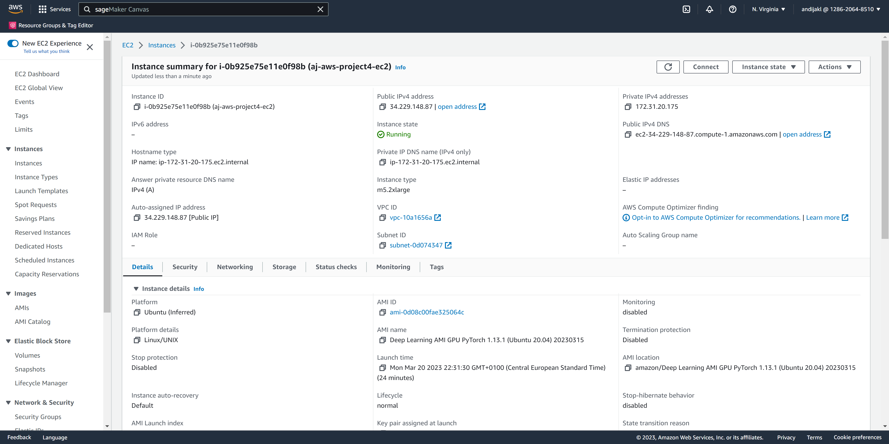

# Operationalizing an AWS ML Project

## Step 1: Training & Deployment

### Initial Setup

To set up the project, create a SageMaker instance. You can either choose to run a Sagemaker Studio. Personally, I prefer the UI of the SageMaker Studio instance. The setup should look like the following:


To run the notebook, I chose the ml.t3.medium, as it's fast enough to run the notebook that will trigger tasks. Also, it is a fast-start enabled instance type, resulting in a shorter wait time.

### Data

Similar to the third project, I downloaded the sample data to the SageMaker Studio storage. The code in the notebook then unzips the data. Finally, I uploaded the data to a newly created s3 bucket for this project. The following screenshot shows the data uploaded to s3:


### Training and Deployment (single instance)

For hyperparameter optimization, I upgraded the default framework to use to a newer version of Python (3.8) and the framework to version 1.9. Also, as the instance type of the starter project isn't available by default in my private AWS account ("ml.g4dn.xlarge", the AWS support would need to be contacted to enable this instance type, as it is rather expensive), I used the "ml.m5.2xlarge" instance type instead. It is fast enough for this training type and costs less. I left max_jobs at 2 and max_parallel_jobs at 1. 

The results of the hyperparameter training:

|	|batch_size	|learning_rate	|TrainingJobName	|TrainingJobStatus	|FinalObjectiveValue	|TrainingStartTime	|TrainingEndTime	|TrainingElapsedTimeSeconds|
|1	|"512"	|0.065706	|pytorch-training-230320-2041-001-0e6f4f4a	|Completed	|2045.0	|2023-03-20 20:42:07+00:00	|2023-03-20 20:54:08+00:00	|721.0|
|0	|"128"	|0.002556	|pytorch-training-230320-2041-002-2e2418b3	|Completed	|167.0	|2023-03-20 20:55:49+00:00	|2023-03-20 21:07:09+00:00	|680.0|

The best hyperparameters found were:  

```
{'batch_size': 128, 'learning_rate': '0.002555801302205963'}
```

Next, I performed training the model with the best hyperparameters. Again, I used the "ml.m5.2xlarge" instance type. Training took 15 minutes. A screenshot of the successful training job:


For the predictor, I used the "ml.t2.medium", as it's cheaper than the one suggested in the sample project and was more than fast enough in the previous project to run inference on a data sample (only took a few miliseconds). The endpoint name is: "pytorch-inference-2023-03-20-21-35-05-877". A screenshot of the running endpoint:


### Training and Deployment (multi-instance)

Next, I updated the estimator setup code to allow the use of multiple instances. This only required one change in the setup code:

```
estimator_multi_endpoint = PyTorch(
    ...
    instance_count=4,
    ....
)
```

I made a small typo in the code and called the variable "estimator_multi_endpoint" instead of "estimator_multi_instance". Next, I deployed another endpoint, as is shown in the following screenshot:


## Step 2: EC2 Training

According to the connect session, I used the following AMI type: "Deep Learning AMI GPU PyTorch 1.13.1 (Ubuntu 20.04) 20230315". For the EC2 instance type, I used the "g5.2xlarge" instance type; the GPU AMI only allows running on GPU-based instances, and the G5 is one of the cheapest available. It's still rather expensive to keep running for some time for experiments, and has more than enough resources for the project we need. The AMI needs at least 45 GB of storage to successfully launch. A screenshot of the created and running EC2 instance:




Next, I used the EC2 Instance Connect feature to log in to the virtual machine. According to the instructions, I downloaded the data using:

```
wget https://s3-us-west-1.amazonaws.com/udacity-aind/dog-project/dogImages.zip
unzip dogImages.zip
```

I then created the "TrainedModels" directory. Next, I created the file "solution.py" and copied the code from "ec2train1.py" into that file.

The instructions contained a missing step, and the AMI image didn't run the script right away. According to the command "conda env list", the AMI has two environments available: "base" and "pytorch". So, I have to activate the corresponding environment first through the command "source activate pytorch", as also instructed when logging into the instance.

