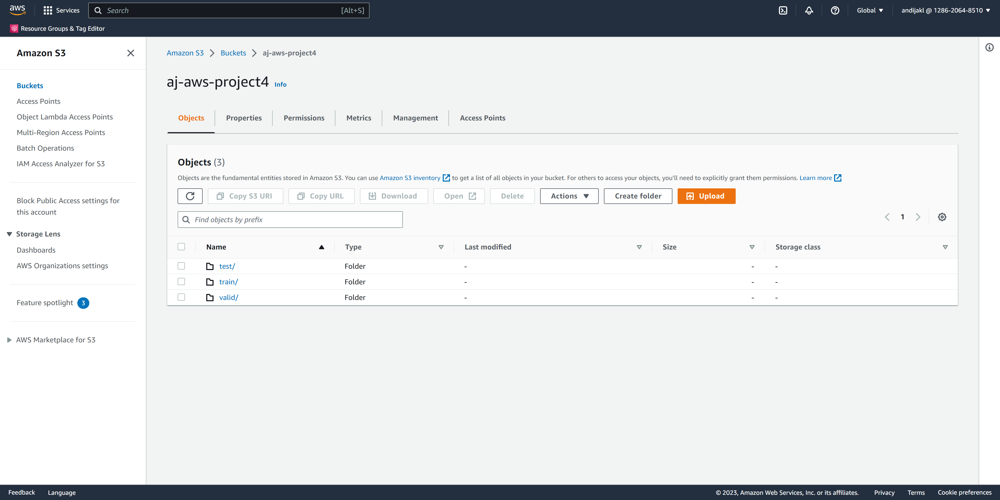

# Operationalizing an AWS ML Project

## Step 1: Training & Deployment

### Initial Setup

To set up the project, create a SageMaker instance. You can either choose to run a Sagemaker Studio. Personally, I prefer the UI of the SageMaker Studio instance. The setup should look like the following:


To run the notebook, I chose the `ml.t3.medium`, as it's fast enough to run the notebook that will trigger tasks. Also, it is a fast-start enabled instance type, resulting in a shorter wait time.

### Data

Similar to the third project, I downloaded the sample data to the SageMaker Studio storage. The code in the notebook then unzips the data. Finally, I uploaded the data to a newly created s3 bucket for this project. The following screenshot shows the data uploaded to s3:



### Training and Deployment (single instance)

For hyperparameter optimization, I upgraded the default framework to use to a newer version of Python (3.8) and the framework to version 1.9. Also, as the instance type of the starter project isn't available by default in my private AWS account (`ml.g4dn.xlarge`, the AWS support would need to be contacted to enable this instance type, as it is rather expensive), I used the `ml.m5.2xlarge` instance type instead. It is fast enough for this training type and costs less. I left "max_jobs" at 2 and "max_parallel_jobs" at 1. 

The results of the hyperparameter training:

|	|batch_size	|learning_rate	|TrainingJobName	|TrainingJobStatus	|FinalObjectiveValue	|TrainingStartTime	|TrainingEndTime	|TrainingElapsedTimeSeconds|
|---|-------|-----------|-------------------------------------------|-----------|-------|---------------------------|---------------------------|-----|
|1	|"512"	|0.065706	|pytorch-training-230320-2041-001-0e6f4f4a	|Completed	|2045.0	|2023-03-20 20:42:07+00:00	|2023-03-20 20:54:08+00:00	|721.0|
|0	|"128"	|0.002556	|pytorch-training-230320-2041-002-2e2418b3	|Completed	|167.0	|2023-03-20 20:55:49+00:00	|2023-03-20 21:07:09+00:00	|680.0|

The best hyperparameters found were:  

```
{'batch_size': 128, 'learning_rate': '0.002555801302205963'}
```

Next, I performed training the model with the best hyperparameters. Again, I used the `ml.m5.2xlarge` instance type. Training took 15 minutes. A screenshot of the successful training job:


For the predictor, I used the `ml.t2.medium`, as it's cheaper than the one suggested in the sample project and was more than fast enough in the previous project to run inference on a data sample (only took a few miliseconds). The endpoint name is: `pytorch-inference-2023-03-20-21-35-05-877`. A screenshot of the running endpoint:


### Training and Deployment (multi-instance)

Next, I updated the estimator setup code to allow the use of multiple instances. This only required one change in the setup code:

```
estimator_multi_endpoint = PyTorch(
    ...
    instance_count=4,
    ....
)
```

I made a small typo in the code and called the variable `estimator_multi_endpoint` instead of `estimator_multi_instance`. Next, I deployed another endpoint, as is shown in the following screenshot:


## Step 2: EC2 Training

According to the connect session, the official way was to use the following AMI type: "Deep Learning AMI GPU PyTorch 1.13.1 (Ubuntu 20.04) 20230315". For the EC2 instance type, I tried to use both the "g5.2xlarge" as well as the "p2.xlarge" instance types; the GPU AMI only allows running on GPU-based instances, and the G5 is one of the cheapest available. It's still rather expensive to keep running for some time for experiments, and has more than enough resources for the project we need. The AMI needs at least 45 GB of storage to successfully launch. However, a default private AWS account doesn't allow launching these instances and I would have needed to write a support ticket to AWS to enable this.

Therefore, I went back to the "t3.medium" instance type with the "Deep Learning AMI (Amazon Linux 2)" AMI, which required a trick pointed out by another scholar in Slack. Here, the running instance in the console:


Next, I used the EC2 Instance Connect feature to log in to the virtual machine. According to the instructions, I downloaded the data using:

```
wget https://s3-us-west-1.amazonaws.com/udacity-aind/dog-project/dogImages.zip
unzip dogImages.zip
```

I then created the `TrainedModels` directory. Next, I created the file `solution.py` and copied the code from `ec2train1.py` into that file.

The instructions contained a missing step, and the AMI image didn't run the script right away. According to the command `conda env list`, the AMI has two environments available: `base` and `pytorch`. So, I have to activate the corresponding environment first through the command `source activate pytorch`, as also instructed when logging into the instance.

In this instance type, there seems to be a misconfiguration and it's not possible to launch it right away. I had to execute this line first to correct the path:

```
PATH=/home/ec2-user/anaconda3/bin:$PATH
```

Finally, it was possible to launch the `source.py` script from within the anaconda pytorch prompt.

The finished training:


### Differences between SageMaker and EC2 code

The scripts that executed from SageMaker have a `main()` function that gets executed once the instance is automatically launches. It then reads parameters and configures and launches the training job based on these.

In contrast, the direct EC2 python execution way defines mostly the same functions, but then simply has the launch code in the main indentation level. It directly sets the parameters in code, executes the training, saves the model and then the script is finished. I also need to shut down the instance myself after training finished.

## Step 3: Lambda Function Setup

I used the provided `lambdafunction.py` script and modified it with my deployed endpoint. The code for the function first imports necessary libraries and then prints a debug output that the function is loading. boto3 is the most important library that provides AWS functions in Python code. The `lambda_handler(event, context)` function is then called when the endpoint is executed. The parameters contain the configuration that is parsed by the function itself. It then invokes the endpoint and in the end returns information. The status code 200 indicates the the request was successful. The `body` then contains the output of the endpoint.

As I continued later, I deployed the endpoint again, which resulted in a different endpoint name. I updated this in the lambda function python script:

```
endpoint_Name='pytorch-inference-2023-03-25-17-52-49-891'
```

## Step 4: Security and Testing

In this step, the task is to create a security configuration. It is required so that the lambda function can invoke the endpoint.

In the configuration part of the lambda function, it prints the name of the role name, in my case `aj-udacity-project4-lambda-role-hml15hqx`. Clicking on it leads to the IAM Management Console with the correct role. I went on to attach a policy and chose the `AmazonSageMakerFullAccess` policy. A policy with less rights would also suffice, but for testing in a non-public environment, it ensures no missing rights interfere another process.

### Testing

Next, I went back to the lambda function and saved and deployed the code. I created a test event using the supplied request dictionary:

```
{ "url": "https://s3.amazonaws.com/cdn-origin-etr.akc.org/wp-content/uploads/2017/11/20113314/Carolina-Dog-standing-outdoors.jpg" }
```

This executed successfully:


The returned data of the function call: 

```
{
  "statusCode": 200,
  "headers": {
    "Content-Type": "text/plain",
    "Access-Control-Allow-Origin": "*"
  },
  "type-result": "<class 'str'>",
  "Content-Type-In": "LambdaContext([aws_request_id=ad75d476-9ee9-4019-a7c1-43a43300d681,log_group_name=/aws/lambda/aj-udacity-project4-lambda,log_stream_name=2023/03/25/[$LATEST]97d800acaf95478da770195aa1b9196d,function_name=aj-udacity-project4-lambda,memory_limit_in_mb=128,function_version=$LATEST,invoked_function_arn=arn:aws:lambda:us-east-1:128620648510:function:aj-udacity-project4-lambda,client_context=None,identity=CognitoIdentity([cognito_identity_id=None,cognito_identity_pool_id=None])])",
  "body": "[[-7.147372245788574, -1.0286768674850464, -0.3423559069633484, 1.4569990634918213, -1.7379196882247925, -1.1202894449234009, -2.1713058948516846, -1.3533273935317993, -3.7444355487823486, 0.7855334877967834, 0.06271706521511078, -2.611976385116577, -2.6801862716674805, -0.25988006591796875, -5.145357608795166, -2.6022632122039795, -4.556575298309326, -0.9784111380577087, -2.714409828186035, 0.31210872530937195, -1.6996418237686157, -1.7557754516601562, -5.342674732208252, -2.5308289527893066, -1.0595412254333496, -4.847294807434082, -2.9565694332122803, -2.308414936065674, -2.4969778060913086, -2.4907944202423096, -1.0609996318817139, -2.406644344329834, -2.839843988418579, -1.8362038135528564, -4.414921760559082, -3.459322690963745, -2.484506368637085, -2.556006669998169, -0.994206964969635, -2.648005962371826, -3.226046323776245, -2.719064474105835, 1.5096323490142822, -1.9650547504425049, -1.390355110168457, -4.649624347686768, -2.6088874340057373, 0.19537515938282013, 0.09271883964538574, -1.2227164506912231, -1.6357882022857666, -5.631409168243408, -5.0621867179870605, -2.367915630340576, -1.5357469320297241, -1.636780023574829, -3.485670804977417, -4.069341659545898, -0.7926552295684814, -2.492372751235962, -4.741054534912109, -3.2556636333465576, -3.70694637298584, -2.8974180221557617, -4.239530563354492, -4.102641582489014, 0.8777875304222107, -4.513336181640625, -2.4113242626190186, 1.3875595331192017, -0.5860968828201294, -4.342031478881836, -3.103930711746216, -3.210773229598999, -2.163743495941162, -0.7306559681892395, -4.628002166748047, -1.1517918109893799, -3.748260498046875, -2.8221137523651123, -0.010341092944145203, -5.828213691711426, 0.8121213912963867, -2.7708899974823, -3.5821173191070557, -4.253695487976074, -2.251962184906006, -3.5046064853668213, 0.1266317367553711, 0.40196943283081055, -5.405091285705566, -2.7970752716064453, -2.7939116954803467, -3.8761141300201416, -1.000701904296875, -0.8735088109970093, -2.7247867584228516, -1.59748113155365, -6.0614013671875, -0.5218075513839722, -3.4550013542175293, -0.9247115254402161, -3.6488261222839355, -0.8803827166557312, -3.764528512954712, -4.348758697509766, -2.4697353839874268, 0.09234718978404999, -0.5132299661636353, -0.20826734602451324, -3.9653193950653076, -2.125741481781006, -3.335204839706421, -3.414344310760498, -3.4018406867980957, -0.8298845887184143, -3.9233994483947754, -1.1374289989471436, -3.1566059589385986, -0.012193739414215088, -2.910207748413086, -0.9841461181640625, -2.388986349105835, -2.973299980163574, -4.169834613800049, -2.4596428871154785, -3.877004384994507, -0.8901241421699524, -3.016940116882324, -3.8220772743225098, -4.104060649871826, -0.5142179727554321, -3.8013808727264404]]"
}
```

### Other Security Considerations

A screenshot of the current IAM security configuration showing the roles attached to the lambda function:


As mentioned before, the `AmazonSagemakerFullAccess` policy offers too much access for just executing and endpoint. It would be better to restrict access to only the specific endpoint that is required. Additionally, it's a good idea to delete the lambda function when it's no longer needed to prevent involuntary access through old scripts for example.

## Step 5: Concurrency and auto-scaling

### Concurrency

Concurrency means that a lambda function can handle multiple requests at once. By default, if two requests arrive at the same time, they are handled one after each other. We can either use reserved or provisioned concurrency. Provisioned concurrency is more responsive, but results in higher costs.

To set up concurrency, I first created a version of the script. As I don't expect a high volume of requests, I only use 2 for provisioned concurrency to save on costs. It would also have been possible to use reserved concurrency to save even more money. In my region, a provisioned concurrency of 2 results in costs of $2.79 per month.

The following screenshot shows the endpoint with successfully configured provisioned concurrency:


### Auto-Scaling

To further improve the performance, it's also possible to set up auto-scaling for the endpoint if this is the bottleneck. In the SageMaker console, I navigate to the deployed endpoint. In the configuration, I scroll down to the "Endpoint runtime settings" section. 

Next, I select the one running with the current instance type (`ml.t2.medium`) and 

As the model prediction is fast, I would choose a low number of maximum instances. It doesn't have to be too low, as the instances are only created on demand anyway and I only need to pay the required instances. A good compromise for the maximum capacity could be 3 instances, minimum capacity at 1 instance. The `Scale-in cool down (seconds)` could be 30 seconds, and the `Scale-out cool down (seconds)` 300 seconds for this configuration and expected workload.

